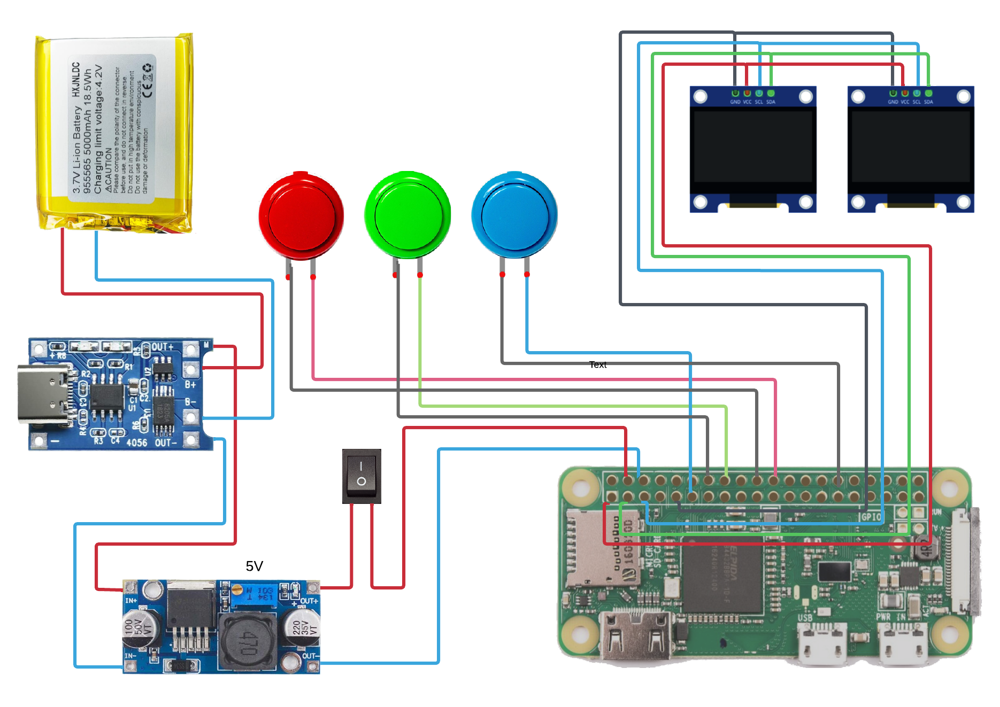

# Hardware
## Components
* 2 x AZDelivery SSD1306 OLED screen
* 1 x Raspberry Pi Zero W
* 1 x TP4056 battery charger
* 1 x MT3608 step up converter
* 1 x 5000MAh LiPo battery
* 3 x Clicker buttons
* 1 x Power button

## Pinout

(Source: https://lucid.app/publicSegments/view/29dfcc4b-7ac9-45ab-b54a-e5f21a3d707d)

### Displays
- Left screen address: 0x3c
- Right screen address: 0x3d

### GPIO pinout
| Switch color | GPIO #|
|------|-----------|
| Red switch |25|
| Green switch (reset) |23|
| Blue switch |17|
| 5V+ input | 04 |
| 5V- input | 06 |
| Screen VCC+ | 01 |
| Screen VCC- | 09 |
| Screen SDA | 03 |
| Screen SCL | 05 |

## Casing
### Components
3D printed from `box_body.stl`.

### Assembly
#### Cables
* TODO
