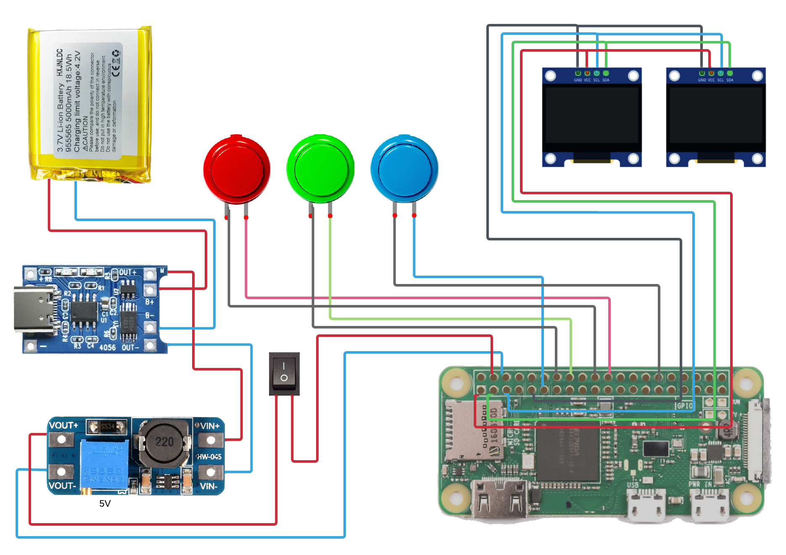

# Hardware
## Components
* 2 x AZDelivery SSD1306 OLED screen
* 1 x Raspberry Pi Zero W
* 1 x PowerBoost 1000 Charger
* 1 x 3000MAh LiPo battery
* 3 x Clicker buttons
* 1 x Power button
* 1 x ~65mm x ~75mm prototype board

## Pinout

(Source: https://lucid.app/lucidchart/0bcb015d-9d2f-48c5-8a88-e3d72c70ac0a/)

### Displays
- Left screen address: 0x3c
- Right screen address: 0x3d

### Switches
| Switch color | GPIO #|
|------|-----------|
|Red|25|
|Green|23|
|Blue|17|

## Casing
### Components
Velleman case G738 (https://www.velleman.eu/products/view?id=60941)

### Cutout diagram

The screen board needs to be 7.5cm x 6.5cm (8 3-holes connectors)

### Assembly
#### Cables
* Raspberry to screen board: 7cm
* Raspberry to buttons: 10cm
* Raspberry to power supply: 17cm
* Power supply to switch: 17cm

#### Spacers
Nylon auto-adhesive spacers 
* Power supply: HC-5
* Raspberry: HC-8
* Screen board: HC-6